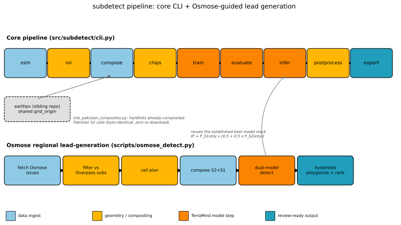
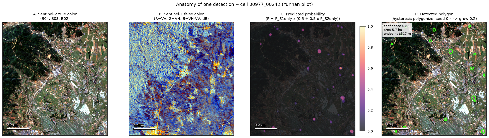
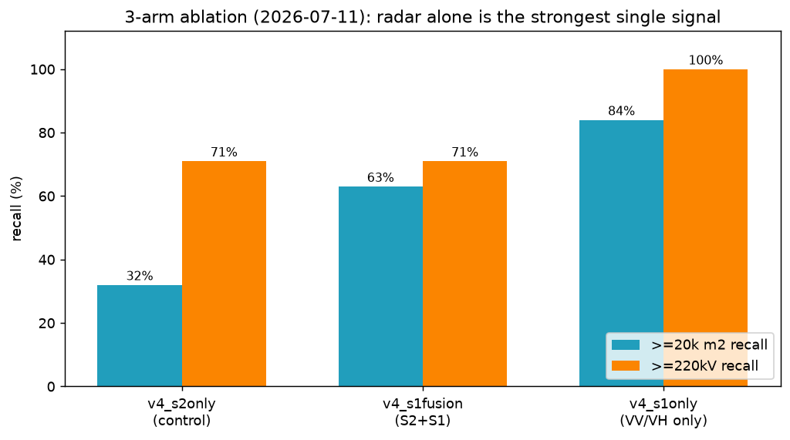
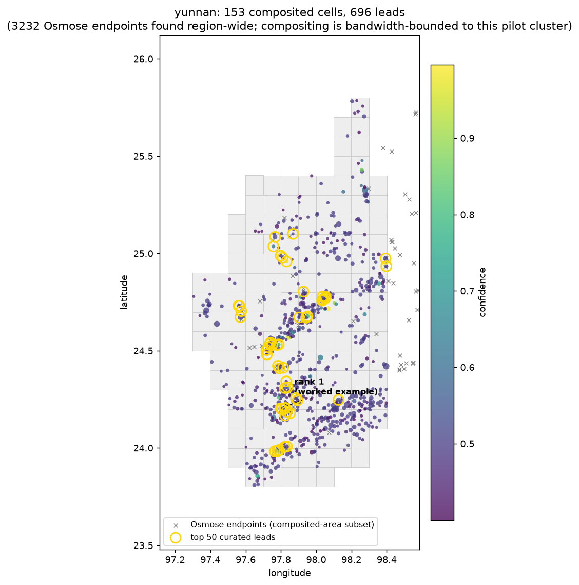

# subdetect — power substation detection from Sentinel-2/-1

⚠️ This is a prototype that is not intended for production or collaboration purposes. If you would like to use this project, please contact the main developer. ⚠️



subdetect finds electrical substations in satellite imagery, then goes one step
further: it uses OpenStreetMap's own data-quality tooling to point itself at
places a substation is *probably missing from the map*, and produces a ranked,
human-reviewable list of leads. The figure below is real output — a real
Sentinel-2/Sentinel-1 image pair, a real model prediction, and a real detected
polygon, from the Yunnan (China) pilot run described later in this README.



*(full walkthrough of this figure: [docs/worked-example.md](docs/worked-example.md))*

## What it does, concretely

It fine-tunes IBM/ESA's **TerraMind** geospatial foundation model (via
**TerraTorch**) to segment transmission-class substations in Sentinel-2 optical
and Sentinel-1 radar composites, using OpenStreetMap power tags as training
labels. New/unfamiliar terms (**TerraMind**, **corner reflector**, **Osmose**,
**hysteresis polygonization**, ...) are defined the first time they matter in
[docs/glossary.md](docs/glossary.md).

- **Training regions:** Pakistan + NW-India pilot (Indian Punjab/Haryana/Delhi), plus mined hard negatives
- **Inference targets:** Pakistan (1,564 cells), India pilot (474 cells), plus two Osmose-guided regional pilots (Yunnan, China; Sindh, Pakistan)
- **Imagery:** cloud-masked dry-season medians (2025-11 → 2026-03), 10 Sentinel-2 L2A bands @ 10 m, optional co-registered Sentinel-1 RTC VV/VH, from Microsoft Planetary Computer (falling back to AWS Earth Search on outage)

## This project depends on a sibling repo: `earthpv`

subdetect is forked from **earthpv** (a rooftop solar PV detection project) and
still depends on it in a load-bearing way, not just historically: the Sentinel-2
band mapping and the 0.1° grid lattice (`grid_origin` in `configs/aoi.yaml`) are
copied *verbatim* so that composited cells are byte-compatible and name-compatible
between the two projects — `scripts/link_pakistan_composites.py` hardlinks
earthpv's already-composited Pakistan cells straight into subdetect at zero
re-download cost. If you're setting this up without access to earthpv's data,
expect Pakistan's `compose` step to take substantially longer than it does here.
Full detail: [docs/architecture.md#the-earthpv-relationship](docs/architecture.md#the-earthpv-relationship).

## Setup

```bash
pixi install          # data pipeline env
pixi install -e ml    # + PyTorch cu126 (Pascal-safe) + TerraTorch
pixi run -e ml gpu-check
```

## Quickstart

```bash
pixi run osm      --aoi pakistan          # Geofabrik PBF -> power lines/substations
pixi run roi      --aoi pakistan          # 0.1° cells within 20 km of grid infrastructure
pixi run compose  --aoi pakistan          # S2 dry-season composites (resumable); --sensor s1 for VV/VH
pixi run chips    --aoi pakistan          # training chips + burned masks; --s1 for dual-modality
pixi run -e ml train    --config configs/terramind_sub_v3b_hardneg_half.yaml
pixi run -e ml evaluate --aoi pakistan --checkpoint <ckpt>   # pixel IoU/F1 + per-installation recall
pixi run -e ml infer    --aoi pakistan --checkpoint <ckpt> --out-dir data/predictions_v3b
pixi run postprocess --aoi pakistan --pred-dir data/predictions_v3b   # polygonize + rank (grid prior)
pixi run export      --aoi pakistan --pred-dir data/predictions_v3b   # GeoJSON / MapRoulette
```

All long steps skip existing outputs, so they can be killed and re-run safely.
Full stage-by-stage explanation: [docs/architecture.md](docs/architecture.md).

## Sentinel-1 + Sentinel-2 fusion: the headline result

The dominant false-positive class is bare land — spectrally similar to a
substation's gravel yard in single-date optical imagery. Radar separates them:
substation gantries and busbars are corner reflectors (bright, especially in
cross-pol VH), smooth bare soil scatters forward (dark). Measured on 150 known
substations vs. 150 human-reviewed bare-land false positives: **VH AUC 0.89**
(`scripts/s1_separability.py`).

That motivated a real architectural fusion model — and the result was a genuine
surprise:



| arm (Pakistan val, 19 installs) | pixel IoU | F1 | ≥20k m² recall | ≥220 kV |
|---|---|---|---|---|
| `v4_s1only` (VV/VH only) | **0.310** | **0.473** | **84%** | **100%** |
| `v4_s1fusion` (S2+S1, mid-fusion) | 0.266 | 0.420 | 63% | 71% |
| `v4_s2only` (control) | 0.243 | 0.391 | 32% | 71% |

**Radar alone beat the fusion model.** The naive mean-merge fusion architecture
diluted rather than combined the two signals. Full mechanism, data pipeline, and
the ongoing retest of this result under a fixed data-starvation confound:
[docs/model-lineage.md](docs/model-lineage.md#v5-removing-the-floor-again).

## Model lineage, in brief

The current best model is the product of several rounds of debugging, not one
training run — including at least one full negative result (see above) and a
training floor that was raised, then deliberately lowered again once the reason
for raising it no longer applied. Full story, all six iterations, with charts:
[docs/model-lineage.md](docs/model-lineage.md).

## Osmose-guided regional detection

`scripts/osmose_detect.py` runs the established best model over *any* region,
worldwide, with no pre-existing labels required — using OpenStreetMap's Osmose
QA engine to find transmission lines that dead-end without reaching a
substation, which is a strong prior that a real, unmapped substation exists
nearby (line-endpoint topology: AUC 0.95 vs. reviewed false positives).



```bash
pixi run -e ml python scripts/osmose_detect.py --region yunnan --country china_yunnan \
    --search-km 20 --tile-deg 1.0 --batch-cells 400 --delete-composites
```

Run as two independent pilots so far — Yunnan, China (153 cells, 696 leads) and
Sindh, Pakistan (145 cells, 614 leads) — both bandwidth-bounded first passes
over a much larger set of Osmose-flagged candidates. Full workflow, output
column reference, and results: [docs/osmose-detect.md](docs/osmose-detect.md).

## Documentation map

- [docs/architecture.md](docs/architecture.md) — full pipeline stage-by-stage, the earthpv relationship, and the `scripts/` catalogue
- [docs/worked-example.md](docs/worked-example.md) — pixel-level walkthrough of one real detection
- [docs/osmose-detect.md](docs/osmose-detect.md) — the Osmose regional workflow, output columns, real results
- [docs/model-lineage.md](docs/model-lineage.md) — the full v1→v9 debugging story, with charts
- [docs/expanding-training-data.md](docs/expanding-training-data.md) — merging in the TorchGeo `Substation` dataset and mining global hard negatives, as runnable walkthroughs
- [docs/glossary.md](docs/glossary.md) — every domain term used across this documentation

## Hardware note

Pinned to torch cu126 wheels: the local GPU is a GTX 1060 (Pascal, sm_61), which
CUDA 13 wheels no longer support. Dual-modality training halves batch size and
doubles grad accumulation to fit 6 GB.
