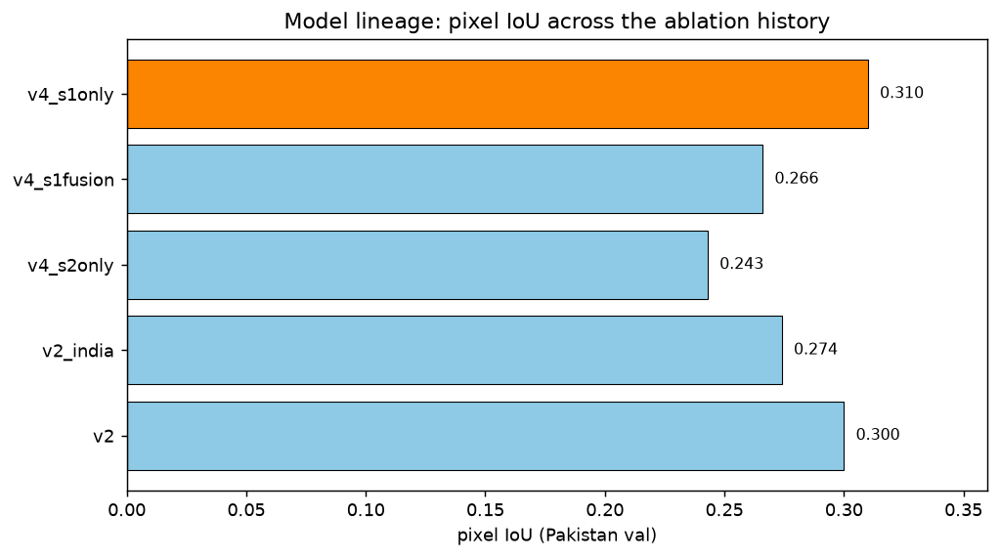

# Model lineage: a debugging story

The model behind subdetect didn't arrive fully formed — it's the result of a
sequence of experiments, several of which were *negative* results that changed
direction. This page tells that story in order, because the reasoning behind each
change is more useful than the final numbers alone.

## The arc

**v1 — too small a floor, the model doesn't learn.** Training masks initially
treated every substation polygon ≥ 1,000 m² as a positive pixel. Real substations
span a huge size range, and the smallest ones are only a handful of 10 m pixels —
essentially unlearnable texture at this resolution. The loss ended up dominated
by these tiny, ambiguous targets, and the model underfit even on its own training
data (pixel IoU for the substation class ≤ 0.11).

**v2 — raise the floor, it works.** Restricting training to substations
≥ 20,000 m² (roughly 200 pixels — large, detectable, transmission-class
installations) fixed the underfitting immediately: pixel IoU 0.30.

**v2_india — more data helps recall, but precision on new leads collapses.**
Adding an India training pilot (same climatic/agricultural domain as the Pakistan
inference target) pushed recall further, but manual review of the top-ranked
*new* (unmapped) candidates found the overwhelming majority were false
positives — mostly bare/exposed natural land confused for a substation's gravel
yard in single-date optical imagery.

**v3 / v3b — hard-negative mining recovers precision.** Since none of those
false-positive locations carry a substation label, chips built there get an
all-background mask automatically — directly teaching the model its own specific
mistake, at zero new-imagery cost (`scripts/mine_hard_negatives.py`).

**v4 — does Sentinel-1 fusion even help?** The dominant false-positive class
(bare land) is spectrally similar to a gravel yard in optical imagery but looks
nothing like one in radar — substation gantries and busbars are corner
reflectors, bright in cross-polarized VH; bare soil scatters forward, staying
dark. Measured directly: **VH backscatter AUC 0.89** separating real substations
from human-reviewed bare-land false positives (`scripts/s1_separability.py`).
That motivated a genuine architectural fusion model (token-level mid-fusion
inside the TerraMind ViT, both modalities trained jointly) — see the ablation
below. The surprising result: **fusion lost to radar alone.**

**v5 (in progress) — remove the floor again, this time with the lessons
learned.** `sindh_test` evaluation showed 88% of mapped substations are *below*
the 20k m² training floor, with only 34% pipeline recall on them (vs. 79% for
≥20k m² installations) — the same underfitting risk v1 hit, but now with a tuned
loss, the S1 modality, and roughly 8× more positive training chips than v1 ever
had. See [below](#v5-removing-the-floor-again) for real, already-measured results.

## The 3-arm ablation (2026-07-11)

Fresh init, identical chips/recipe, only the input modality differs:

| arm (Pakistan val, 19 installs) | pixel IoU | F1 | ≥20k m² recall | ≥220 kV recall |
|---|---|---|---|---|
| `v4_s2only` (control) | 0.243 | 0.391 | 32% | 71% |
| `v4_s1fusion` (S2+S1, mid-fusion) | 0.266 | 0.420 | 63% | 71% |
| `v4_s1only` (VV/VH only) | **0.310** | **0.473** | **84%** | **100%** |

Radar alone posted the best numbers of any model in the project up to that
point. The naive mean-merge fusion architecture *diluted* rather than combined
the two signals — a real, measured negative result, not a hypothesis. Caveats
worth keeping in mind: a 19-installation validation set and a single training
seed; if fusion is revisited, the README suggests concat-merge or longer
training as the next thing to try, given the S1/S2 false-positive *profiles*
differ (S2 models fail on bare land, S1 models fail on other radar-bright metal
structures like industry/rail) — genuine complementary fusion should in
principle be possible, this specific merge strategy just didn't achieve it.

## v5: removing the floor again

Two arms retrained on a floor-removed chip set (`min_area_m2=0` — every
substation polygon becomes a positive training pixel, not just ≥20k m² ones),
otherwise identical architecture/loss/schedule to v4. Evaluated head-to-head
against the matching v4 checkpoint on the *same* no-floor validation chips (196
chips), so the numbers below are directly comparable to each other but **not**
to the v4 table above, whose validation masks only ever contained ≥20k m²
targets in the first place.

| | v4 s1only | v5 s1only | v4 s2only | v5 s2only |
|---|---|---|---|---|
| pixel IoU | 0.125 | **0.236** | 0.136 | **0.158** |
| pixel F1 | 0.222 | **0.382** | 0.239 | **0.272** |
| 2,000–5,000 m² recall | 28.4% | **36.5%** | 4.1% | 2.7% |
| 5,000–20,000 m² recall | 57.4% | **66.2%** | 11.8% | **27.9%** |
| ≥20,000 m² recall | 71.4% | 71.4% (unchanged) | 33.3% | **42.9%** |
| false positives (pixels) | 70,658 | **16,620** | 16,751 | 18,296 |

The key result: **s1only's recall on the size class the floor was originally
raised to protect (≥20k m²) didn't regress at all** (71.4% both), while recall
below that floor improved substantially and false positives dropped sharply.
The 2026-07-08 underfitting failure mode did not recur — the combination of a
tuned Tversky loss, the S1 modality, and far more positive training data
evidently gave the model enough signal to handle small substations without
diluting the large-substation objective. One flat spot: the smallest bucket
(1,000–2,000 m²) stayed at 0% recall for every model tested regardless of
training regime — that looks like a genuine resolution floor (≤14 pixels at
10 m), not something a training change can fix.

**Fusion retrain, in progress as of this writing:** the same no-floor chip set
is also being used to re-test the v4 fusion ablation, to separate two possible
explanations for fusion's v4 loss that were previously confounded: (a) the
mean-merge architecture genuinely dilutes signal, or (b) `v4_s1fusion` was just
as data-starved as the old `v4_s1only` baseline and never got a fair test. If
v5's fusion arm still loses to `v5_s1only` with the data variable now matched,
that confirms the merge mechanism is the real bottleneck. If it closes the gap
or wins, the original ablation was confounded by data starvation rather than
architecture. This section will be updated with the result once training
finishes and is committed.

## Open problem: the 0.5 plateau

The production decision-level fusion, `P = P_S1only × (0.5 + 0.5 · P_S2only)`,
has a structural property worth knowing about: any pixel where the S1 model is
fully confident but the S2 model is neutral evaluates to *exactly* 0.5,
regardless of how confident S1 actually was. Measured on real pilot data,
roughly 60% of Osmose-pilot candidates land on this plateau — see it directly in
the [worked example](worked-example.md#c-predicted-probability).

This was tested rigorously (`scripts/eval_polygonize_v2.py`, validated against
both the Yunnan pilot and `sindh_test` real labels): no statistic computed from
the *fused* probability raster alone — not max, not top-decile mean, not mean —
can meaningfully rank candidates within that plateau (measured within-plateau
AUC 0.538 — no better than random — on a 23-positive `sindh_test` sample; the
Yunnan pilot only had 3 plateau positives, too few to trust on its own but
directionally consistent). The information genuinely isn't there once the two
models' outputs are compressed into one number. The fix isn't a smarter
statistic; it's exposing what the fusion
discards — writing separate `mean_s1`/`mean_s2` columns per candidate (a small
change to `gated_inference` in `scripts/osmose_detect.py`) so ranking can use
both models' opinions instead of their collapsed product. Not yet implemented as
of this writing.

## What *did* improve ranking: hysteresis + a line-proximity prior

Two changes were tested and adopted together, validated on `sindh_test` against
real Pakistan substation labels:

- **Hysteresis polygonization** (seed 0.4, grow 0.2, replacing a single 0.3
  threshold) merged fragmented detections and recovered one additional mapped
  substation on both validation corpora, at unchanged ranking AUC.
- **Line-proximity prior**: real substations sit *on* the transmission grid — 75%
  of true detections in `sindh_test` had `line_dist_m = 0`, vs. a 1.8 km median
  for non-hits. Folding `exp(−line_dist_m / 500)` into `rank_score` lifted AUC
  0.769 → 0.967 and precision@20 0.70 → 0.90 — the strongest single ranking
  signal measured in this project.

Full detail and the output-column reference: [Osmose-guided detection](osmose-detect.md).
