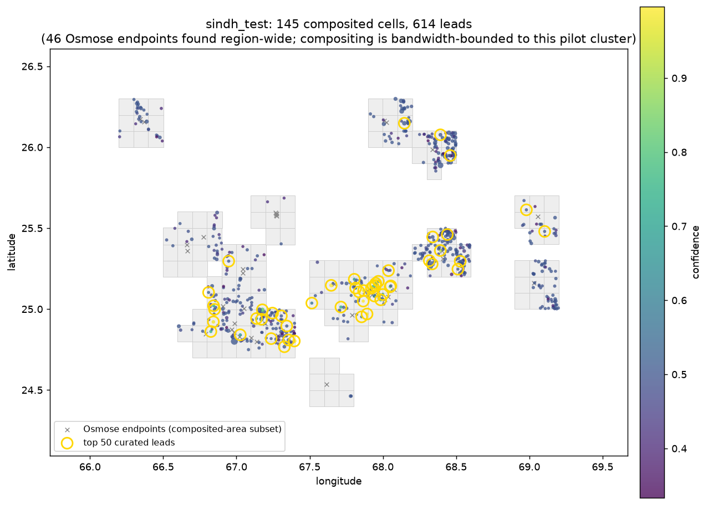

# Osmose-guided regional detection

`scripts/osmose_detect.py` runs the established best model over *any* region,
worldwide, without needing pre-existing substation labels for that region —
using OpenStreetMap's own data-quality tooling to decide where to look.

## Why this works: lines don't just end

OpenStreetMap's [Osmose](https://osmose.openstreetmap.fr) QA engine flags one
specific issue relevant here: **item 7040, class 2**, "unfinished major power
line" — a transmission line that's been digitized in OSM but terminates without
reaching a mapped substation. Power lines don't actually end in a field; if OSM
shows one dead-ending, either (a) the substation it connects to just hasn't been
mapped yet, or (b) it's a genuine mapping-detail gap near an already-mapped
substation. Filtering out case (b) — endpoints within 700 m of a known substation
(live Overpass query, works anywhere with no local label data) — leaves a list of
locations with an unusually strong prior: *there is very likely a real, unmapped
substation near here.* Line-endpoint topology was the single strongest
false-positive discriminator measured in this project (AUC 0.95), which is what
makes this such an effective search strategy compared to scanning imagery blind.

## The six steps

```bash
pixi run -e ml python scripts/osmose_detect.py --region yunnan --country china_yunnan \
    --search-km 20 --tile-deg 1.0 --batch-cells 400 --delete-composites
# dry run (fetch + cell-plan + cost estimate only, no compositing):
#   add --dry-run
```

1. **Fetch Osmose issues** for the given country/region code (see
   [osmose.openstreetmap.fr](https://osmose.openstreetmap.fr) for valid codes,
   e.g. `china_yunnan`, `pakistan`). Fetched in bbox tiles (`--tile-deg`, default
   2°) since the API caps at ~500 issues per request — a region with dense
   coverage needs a finer tile size or results silently truncate.
2. **Filter endpoints**: fetch every `power=substation` (any size, including bare
   nodes) in the region live from Overpass, drop any Osmose endpoint within
   `--sub-dist-m` (default 700 m) of one as mapping-detail noise, not a real gap.
   Survivors → `endpoints.geojson`.
3. **Cell plan**: every 0.1° grid cell within `--search-km` (default 10 km) of a
   surviving endpoint.
4. **Compose S2 + S1** dry-season composites for exactly those cells (same code
   paths as the core pipeline; S1 pinned to the S2 grid). Resumable, and (with
   `--batch-cells`) composes the next batch on a background thread while
   inference runs on the current one, so compute and network overlap instead of
   serializing.
5. **Detect** with the established best model stack — see
   [Model lineage](model-lineage.md) for how this stack was chosen:
   `P = P_S1only × (0.5 + 0.5 · P_S2only)`, tiled with Hann-window blending across
   overlapping windows.
6. **Post-process**: hysteresis-polygonize (seed 0.4, grow 0.2 — kept below the
   0.5 fusion plateau so S1-only detections survive intact), flag (not drop)
   candidates below the training area floor, and rank by
   `confidence × exp(−endpoint_dist / 2 km) × exp(−line_dist / 500 m)` — real
   substations sit *on* the grid, so proximity to a mapped OSM power line turned
   out to be the single strongest ranking signal measured (sindh_test: AUC
   0.769 → 0.967 once added).

## Real results: two independent pilot regions




| region | composited cells | leads | curated top-N |
|---|---|---|---|
| Yunnan, China | 153 | 696 | 50 (`leads_pilot_top50.geojson`) |
| Sindh, Pakistan | 145 | 614 | — |

Both regions were run as bandwidth-bounded *pilots*: Osmose typically flags
thousands of candidate endpoints across a whole province/region (3,232 survived
the Overpass filter across all of Yunnan in this run), but full-region
compositing of every resulting cell is a multi-day, multi-terabyte undertaking —
see the honest cost accounting these two runs generated in project memory. Both
maps above are therefore one worked cluster each, not full provincial coverage;
see the [worked example](worked-example.md) for a pixel-level look at the single
highest-ranked Yunnan cell.

## Output columns (`leads.geojson` / `leads_pilot.geojson`)

| column | meaning |
|---|---|
| `confidence` | peak predicted probability inside the polygon (alias for `conf_max`) |
| `conf_p90` | top-decile mean probability — tested as a `confidence` replacement, not adopted (see [Model lineage](model-lineage.md)) |
| `conf_mean` | mean probability across the whole polygon, including the hysteresis-grown halo |
| `n_pixels` | polygon pixel count — kept as a diagnostic column only; tested and rejected as a ranking input (anti-correlated with precision) |
| `area_m2` | geodesic polygon area |
| `below_floor` | `True` if `area_m2` is under the training area floor — sunk to the bottom of the review order, not dropped |
| `endpoint_dist_m` | distance to the nearest surviving Osmose endpoint |
| `n_endpoints_in_radius` | how many endpoints fall within `--search-km` of this candidate |
| `line_dist_m` | distance to the nearest OSM `power=line` (Overpass) |
| `rank_score` | `confidence × exp(−endpoint_dist_m / 2000) × exp(−line_dist_m / 500)` — the default sort order, tuned for *"does this explain an Osmose issue"*, not general substation-finding |

**Which column to sort by depends on your goal.** `rank_score` (the default file
order) answers *"which candidates best explain the Osmose unfinished-line
issues"* — exactly the pipeline's original design goal. If instead you want a
general "any plausible unmapped substation, regardless of nearby Osmose issues"
review order, re-sort by `confidence` directly. The [worked example](worked-example.md)
shows a concrete case where these two orderings disagree on which candidate to
look at first.

## Every lead needs a human

This pipeline generates *candidates*, not confirmed substations. Precision at
any individual confidence threshold is nowhere near 100% (see the ablation
numbers in [Model lineage](model-lineage.md)) — every lead should be checked
against high-resolution imagery (or ideally ground truth) before it's used to
edit OpenStreetMap.
